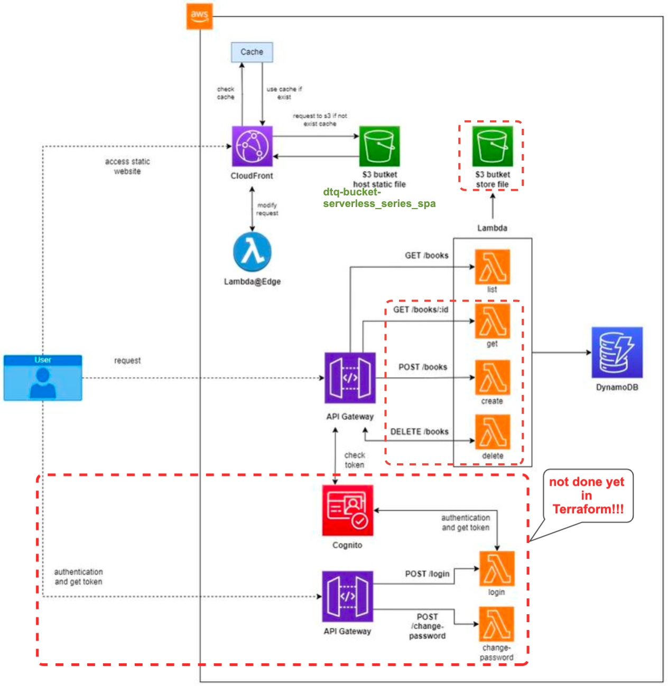
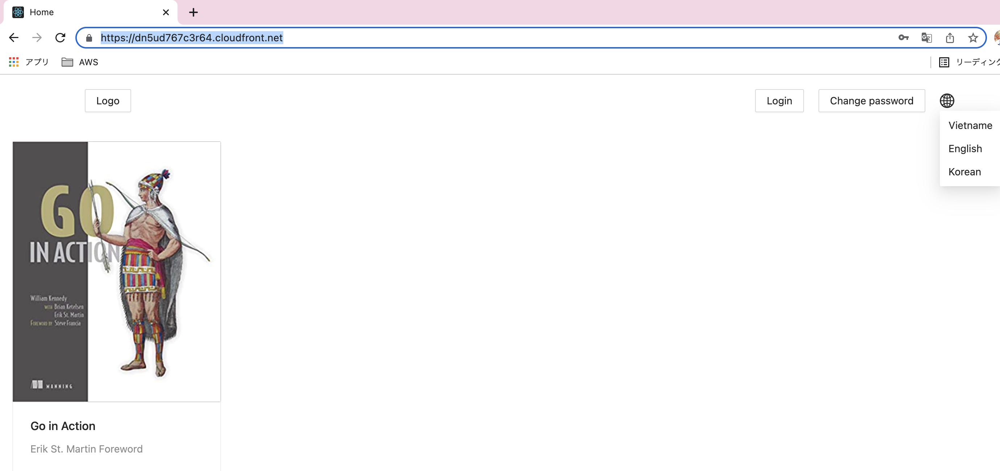
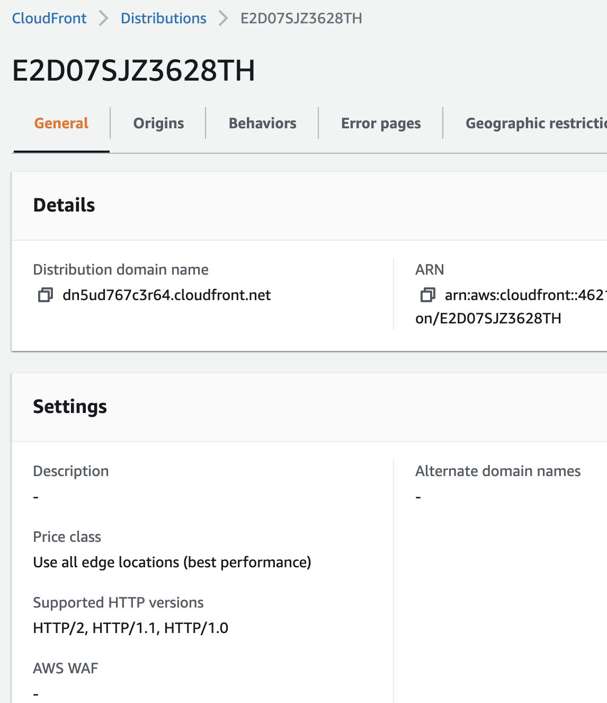
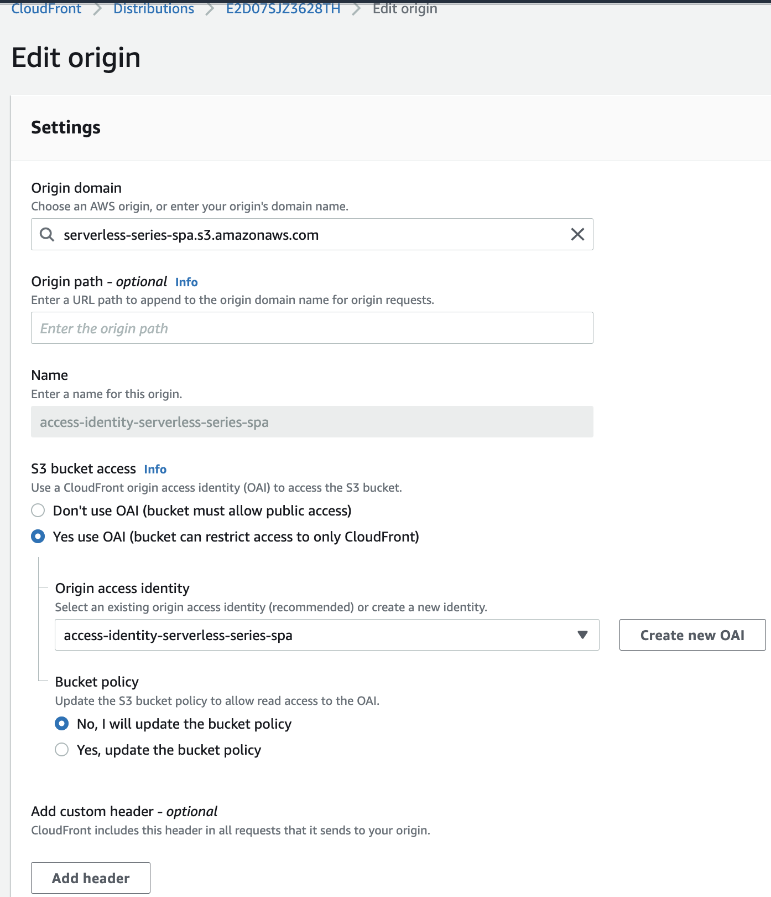
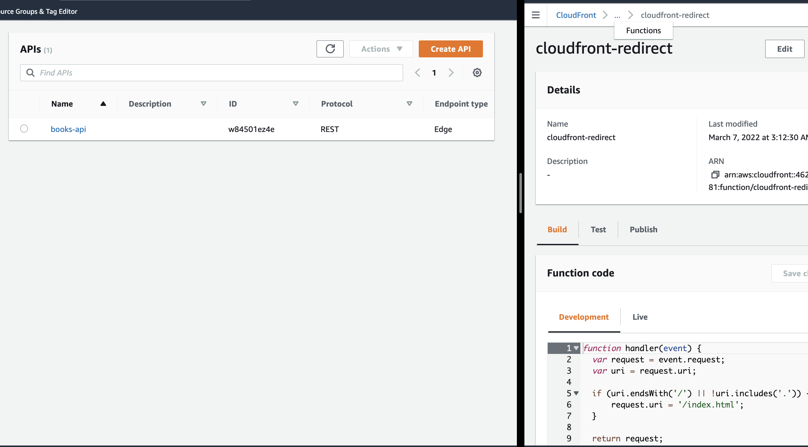
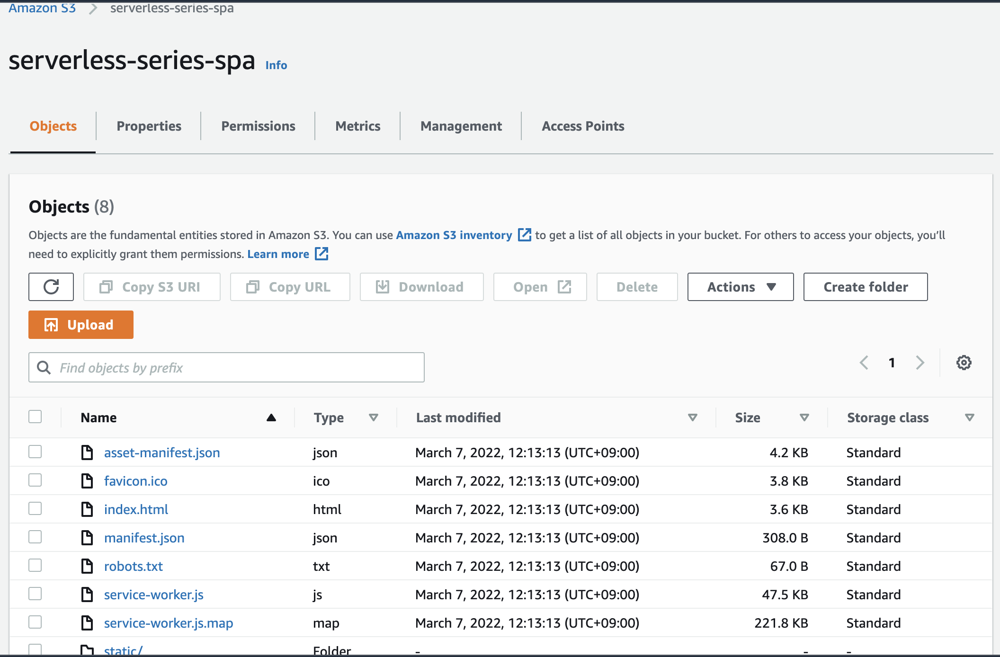
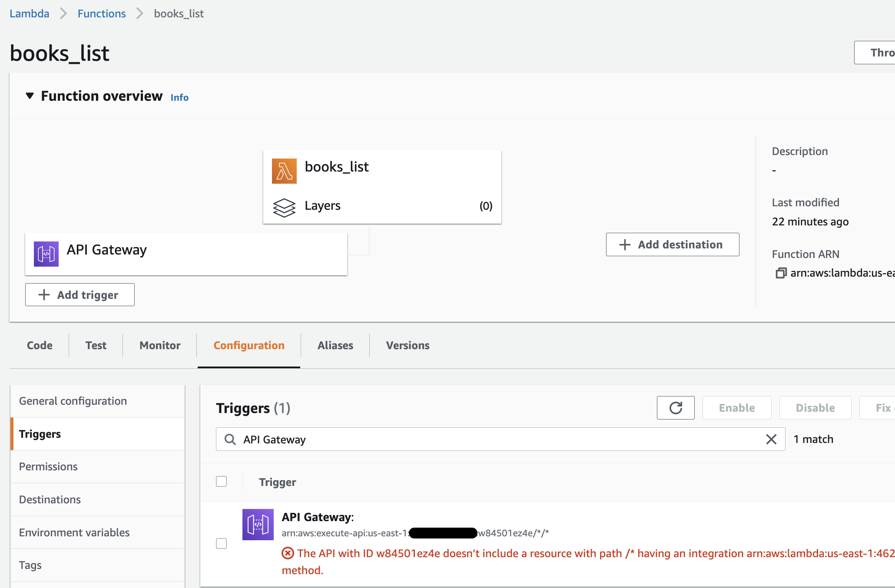
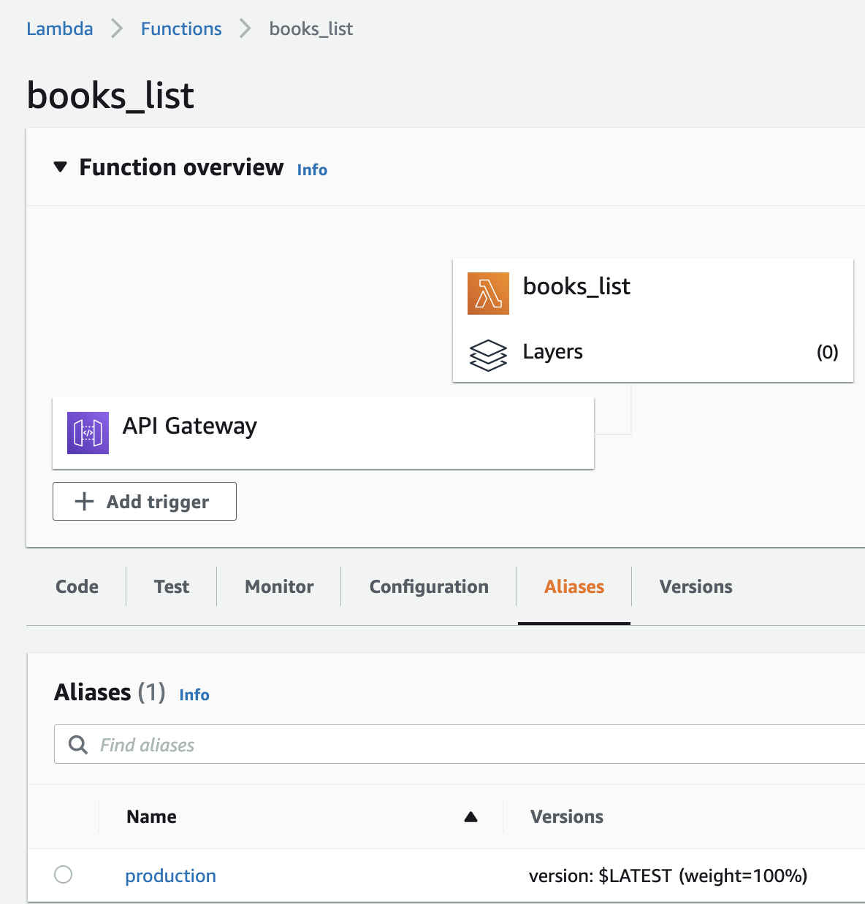
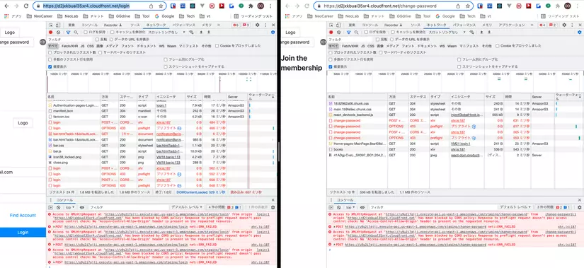

# aws-terraform-spa-reactjs-golang 🐳


[](https://github.com/tquangdo/aws-terraform-spa-reactjs-golang/issues/new)



## reference
[viblo](https://viblo.asia/p/serverless-series-golang-bai-6-using-cloudfront-and-lambdaedge-for-static-caching-bJzKmdeD59N)

## project structure
1. ### "terraform-start"
    - root folder
1. ### "terraform-start/front-end"
    - FE folder, code by ReactJS
    - connect with tf by "${path.module}/front-end"
1. ### "terraform-start/source"
    - BE folder, code by Golang
    - connect with tf by "source"
1. ### the others
    - tf files
    - connect with FE: `terraform-start/s3.tf`
    ```lua
    cd ${path.module}/front-end && yarn install
    ...
    cd ${path.module}/front-end && sed -i -- "s|staging_api|${aws_api_gateway_deployment.staging.invoke_url}|g" .env-cmdrc
    ...
    cd ${path.module}/front-end && yarn build:staging
    ...
    cd ${path.module}/front-end && aws s3 cp build s3://serverless-series-spa --recursive
    ```
    - connect with BE:
    1. `terraform-start/lambda.tf`
    ```lua
    filename         = "source/list.zip"
    source_code_hash = filebase64sha256("source/list.zip")
    ```
    2. `terraform-start/cloudfront.tf`
    ```lua
    resource "aws_cloudfront_function" "cloudfront_redirect" {
        name    = "cloudfront-redirect"
        runtime = "cloudfront-js-1.0"
        publish = true
        code    = file("source/index.js")
    }
    ```

## run terraform
- copy paste from `terraform-start/front-end/.env-cmdrc.origin` to `terraform-start/front-end/.env-cmdrc` (because will auto edit json code: staging>REACT_APP_API_URL)
> ⚠️⚠️ WARNING ⚠️⚠️: just RUN with node v14.19, NOT with newer version!!!
- `cd terraform-start && terraform init && terraform apply -auto-approve`

## result
1. ### website
    
1. ### cloudfront
    
    ---
    
1. ### apigw
    
1. ### s3
    
1. ### lambda
    
    ---
    

## NOT done yet!!!
- Do cái login cái change password thì cần phải có Cognito nữa nha, mà có Cognito thì hai hàm login với change password phải chuyển sang os.GetEnv() thì mới lấy được ClientId của Cognito, cái này mình chưa làm nên mình chưa thêm vào được.

